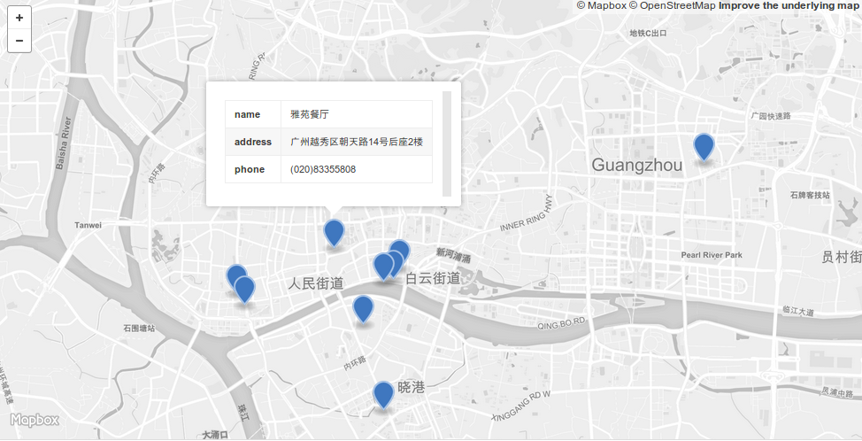

# 品城记

记录那些[品城记](www.acfun.cn/u/10725427.aspx)探过的餐厅

## 广州

* 成记爬金山

  番禺区沙湾镇东村经述路沙场巷二横巷 9 号(青萝市场前 50 米右转)

* 林记粥品店

  越秀区海珠南路 157 号(大新路同一德路之间,近陈仲生牙科诊所)

* 竹园竹升面店

  荔湾区黄沙大道荔枝湾风景区 2 期 C4 号铺(侨美唐荔园酒楼旁小路直入 100 米)

* 周生记太爷鸡

  文明路 37 号
